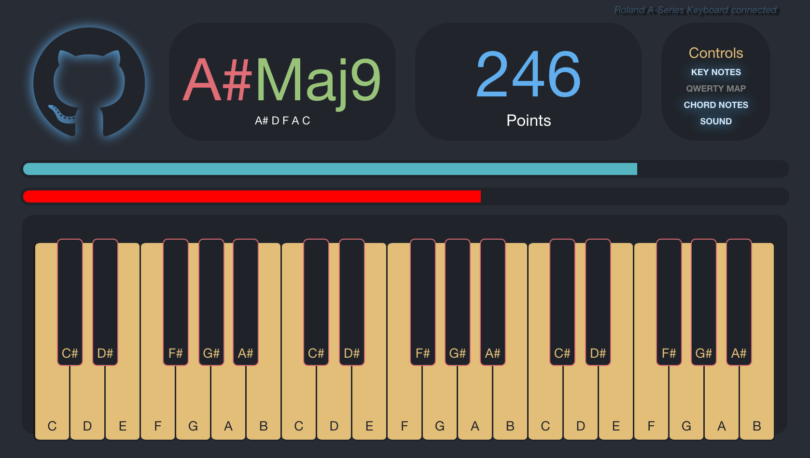

# ChordWars

[ChordWars live][live]

[live]: https://pyreta.github.io/ChordWars/

ChordWars is single page browser game designed for music education.  Upon starting the game, the player must play a randomly displayed chord on a virtual piano before the time runs out.  If the chord is not played in time, the penalty bar will rise.  Once the penalty bar reaches a certain threshold, the game is over.  ChordWars is built with a React.js and flux architecture allowing for seamless animation and a dynamic user interface.

## Features & Implementation

### MIDI Hardware Compatible
  ChordWars implements the WebMidi API to allow for a true music education experience for students.  By allowing keyboard compatibility, ChordWars extends beyond just a game, and actually works to develop rote memorization of chord notes, and positions.  Using a USB midi controller is seamless.  Installation just requires the page is refreshed while the controller is plugged in.  If the device is recognized, the model and manufacturer will appear in the top left corner, and the QWETRY map will automatically be turned off.

### Responsive and Beautiful UI.

  Upon loading the game, the user is greeted with enticing graphics, and an options menu.  Any difficulty level harder than "easy" will incrementally increase in speed with each passing chord.
  
  The layout of ChordWars is designed for clarity, aesthetics, and display adaptability. With larger screens, a full 3 octavs appear, along with large controls and windows.

  

  Smaller displays will render a compact view with less keys, and smaller options.
  

  Controls are displayed allowing for scaffolds during learning which may be switched on or off based on preference and experience level.  This adds another dimension to matching the games challenge with the players ability.

  

### Chord Logic

  Every Chord that appears in the chord window is generated randomly, and then displayed in the window.
  
  Chord key and character is randomly selected within a `Chord` class.  Each instance of the `Chord` class has a `notes()` function.  This function references the `Note` class to calculate the appropriate intervals.

  Chord Class:

  

  Note Class:

  

### Behind the Keys
  ChordWars is build with React.js, JavaScript, Flux, CSS, and HTML.  Throughout the game, animations are triggered by game events and user interaction.  This requires the constant manipulation of document elements by changing classes.  Instead of importing a full library like jQuery, custom light-weight DOM manipulation methods are constructed and deployed throughout game-play.

  Everything in ChordWars is a React component.  Components are reused and tweaked for different purposes (e.g. black and white keys, time and health bars).  This keeps readability as high as possible.

  Note events trigger a `KeyAction` which calls upon the `AppDispatcher` where the correct note information is then stored with the `KeyStore`.  The main `App` component is listening to this store.  Every time the store is updated, the `App` updates its state and then checks the current "played" notes against the correct notes of the chord.  The comparison logic allows for any voicing, as long as the correct notes and *only* the correct notes are played.

  The actual sounds are audio samples triggered through `HTML5` audio tags.

  And the end of game-play the user is prompted to either play again, or check out the github repository

### Next Steps
  The next phase of developing ChordWars extend beyond a game and introduce a whole interactive music learning center based on Codecademy.  The possibilities of providing an entertaining learning experience for piano and keyboard students are endless given the new MIDI capabilities in browsers.
